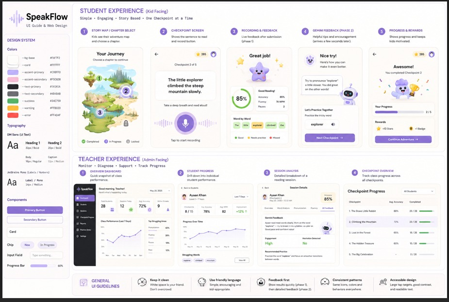

# SpeakFlow 🎙️✨

**SpeakFlow** is an intelligent, story-based speech and reading companion designed to empower young learners through engaging checkpoint adventures, real-time speech evaluation, and AI-powered feedback, paired with actionable diagnostics for teachers and educators.

---

## 🎨 UI Guide & Web Design System

---

## 🌟 Key Experiences

### 👶 Student Experience (Kid Facing)
*Simple • Engaging • Story-Based • One Checkpoint at a Time*

1. **Story Map / Chapter Select**: Kids explore their learning journey through visual adventure maps and select chapters.
2. **Checkpoint Screen**: Clear sentence-by-sentence reading prompts with an intuitive tap-to-record interface.
3. **Recording & Instant Feedback (Phase 1)**: Real-time analysis providing word-by-word accuracy, reading speed (WPM), and fluency scores.
4. **Gemini Feedback & Coaching (Phase 2)**: Encouraging, AI-generated pronunciation tips and interactive practice exercises.
5. **Progress & Rewards**: Gamified milestone celebrations with stars, badges, and progress tracking to keep learners motivated.

---

### 👩‍🏫 Teacher Experience (Admin Facing)
*Monitor • Diagnose • Support • Track Progress*

1. **Overview Dashboard**: Quick snapshot of class performance, active streaks, daily sessions, and struggling focus areas.
2. **Student Progress**: Deep-dive analytics into individual learner metrics over time.
3. **Session Analysis**: Granular breakdown of individual reading sessions, hesitation detection, and AI feedback logs.
4. **Checkpoint Overview**: Cohort-level progress tracking across chapters and difficulty levels.

---

## 📐 Design System & Guidelines

- **Typography**:
  - `DM Sans` for UI Text and headings.
  - `JetBrains Mono` for data labels, metrics, and numbers.
- **Palette**:
  - **Base Background**: `#FAF7F2`
  - **Card Background**: `#FFFFFF`
  - **Accent Primary**: `#C9BFF0`
  - **Accent Secondary**: `#F5C6DB`
  - **Success / Warning / Error**: `#34C759` / `#FFB020` / `#FF4D4F`
- **Core Principles**:
  - *Keep it Clean*: Ample white space; avoid overwhelming young learners.
  - *Friendly & Encouraging*: Supportive copy tailored for children.
  - *Feedback First*: Deliver immediate phase-1 metrics followed by deep phase-2 AI guidance.
  - *Accessible & Touch-Friendly*: Large tap targets, high contrast, and readable typefaces.

---

## 👥 Organization & Collaboration

Developed by **[TeamXOF](https://github.com/TeamXOF)**.
