<div align="center">

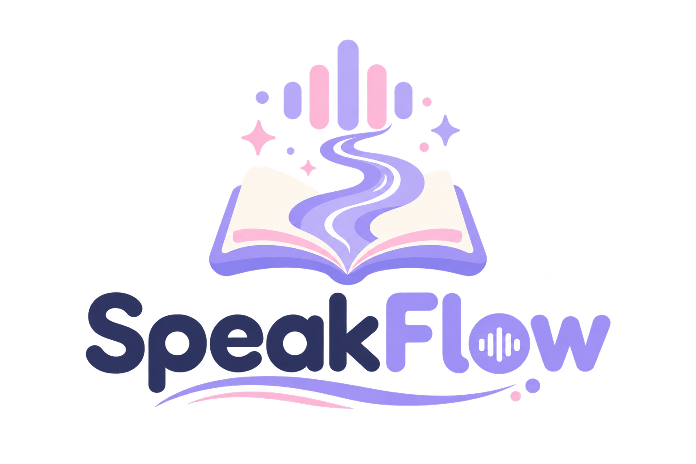

# SpeakFlow AI

**Listen to how a child reads. Understand why they struggle. Practice, every day.**

An AI-powered reading-fluency platform for young learners, bilingual in **English & Urdu**,
that evaluates real speech acoustically (not just transcription), coaches children word-by-word,
and gives teachers a diagnostic control room.

<br>


`✨ Features` • `📸 Showcase` • `🏗️ Architecture` • `🌐 Bilingual` • `⚡ Quick Start` • `🗺️ Roadmap`

</div>

---

## 🎯 Why SpeakFlow exists

### The classroom problem

A grade-3 teacher has **30 students and maybe 10 minutes of one-on-one time per day**. There is
no way to listen to every child read individually, hear exactly *which* sounds they get wrong,
write parent updates, and still teach the class. So struggling readers stay invisible until
they are years behind.

**SpeakFlow is the teacher's ears at scale.** Every child reads aloud to the app at the same
time; SpeakFlow listens to each one individually, word by word, letter by letter, sound by
sound, gives the child instant coaching and stars, and hands the teacher a class-wide
diagnostic: which student is struggling, on exactly which sounds, this week versus last week.
One teacher. Every child. Every day.

### Why most reading apps get it wrong

When a child reads aloud, most apps only check *which words the transcript contains*. That quietly
hides real problems: speech recognizers "autocorrect" grammar (`jump` → `jumped`), skipped word
endings disappear, and inserted words are ignored, so a struggling reader can score 100%.

SpeakFlow is built around **honest measurement**:

- **Acoustic + alignment scoring.** Every spoken word is scored against the printed sentence
  using real audio evidence (pitch, energy, formants), not just transcript strings.
- **Morphology-aware.** Saying *sleep* for *sleeping* is reported as `missing -ing`, not passed
  off as correct.
- **Nothing slips through.** Skipped words, inserted words and low-confidence reads are all
  flagged, in both engines.
- **Everything a child says stays local.** Recordings are analyzed in-request and deleted
  immediately; only scores are stored.

The result is a platform a teacher can trust: two complete reading experiences (a live
**multi-agent analysis dashboard** and a gamified **Story Mode**), a personalized practice
engine that tracks what is *improving* and what has been *conquered*, and full
**English + Urdu** support end to end.

---

## 📸 Visual Showcase

<table>
<tr>
<td width="50%" align="center">
  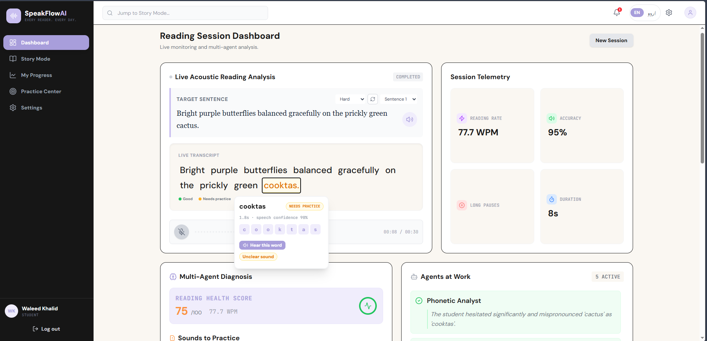
  <br><i><sub><b>Reading Session Dashboard</b>: live acoustic analysis with a fresh AI-generated sentence every session, word-level coloring and five AI agents.</sub></i>
</td>
<td width="50%" align="center">
  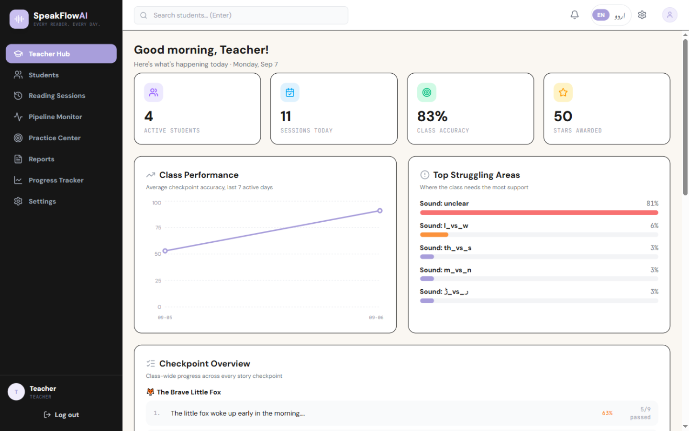
  <br><i><sub><b>Teacher Hub</b>: class accuracy trends, struggling-sound rankings (English & Urdu) and per-checkpoint progress across every story.</sub></i>
</td>
</tr>
<tr>
<td width="50%" align="center">
  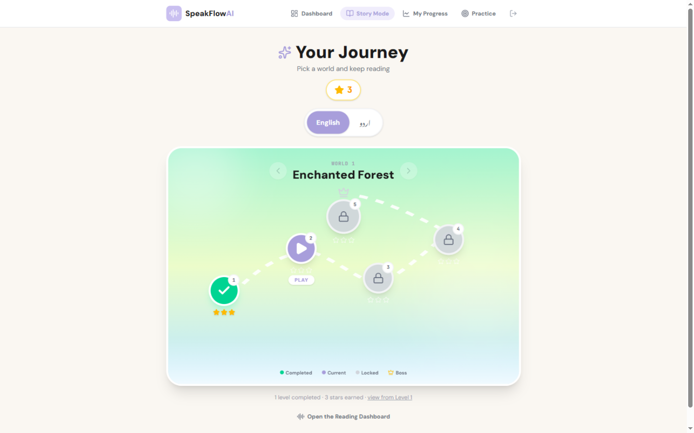
  <br><i><sub><b>Story Mode</b>: an endless dual-track level map (English / اردو): themed worlds, boss levels, star ratings and unlock progression that never caps.</sub></i>
</td>
<td width="50%" align="center">
  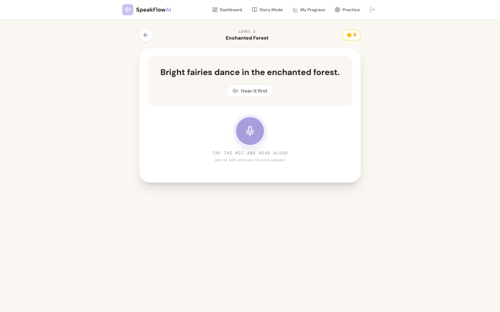
  <br><i><sub><b>Level player</b>: hear the sentence, record, and get a star rating, word-level verdicts and a letter-by-letter inspector.</sub></i>
</td>
</tr>
<tr>
<td width="50%" align="center">
  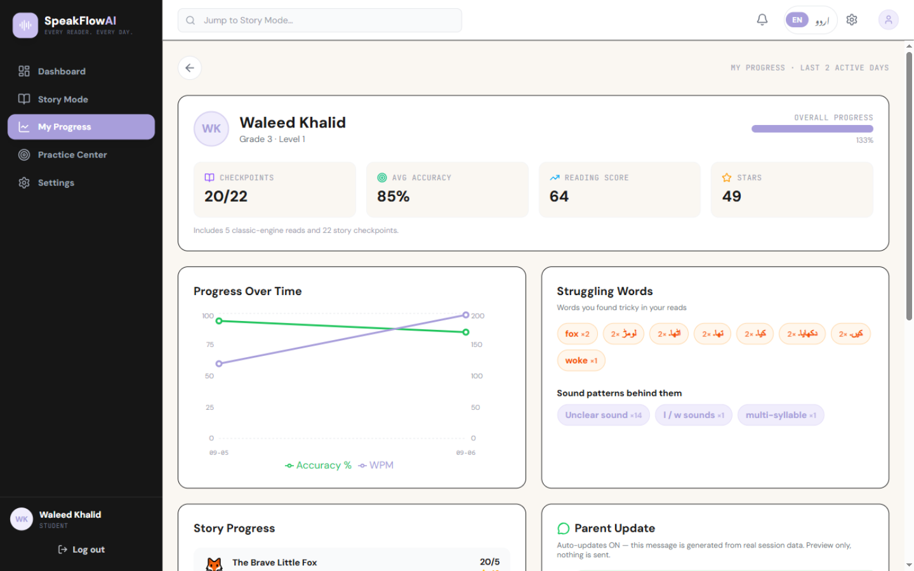
  <br><i><sub><b>My Progress</b>: merges classic-engine reads and story checkpoints into one trend, with struggling words and the sound patterns behind them.</sub></i>
</td>
<td width="50%" align="center">
  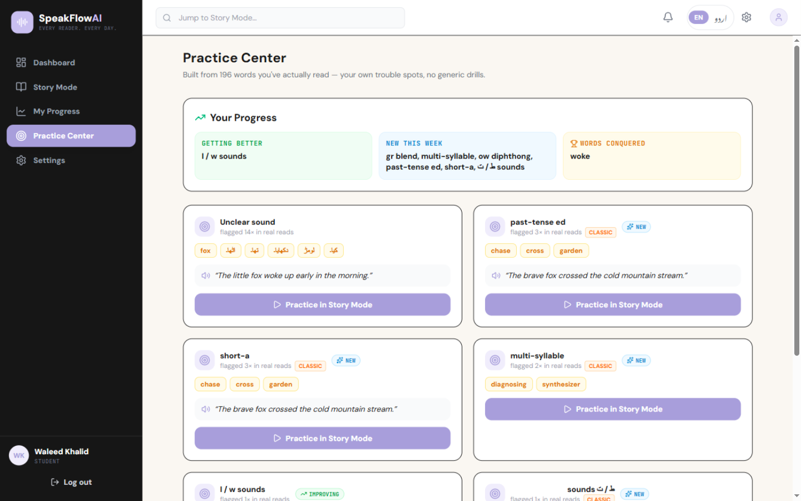
  <br><i><sub><b>Practice Center</b>: exercises generated from the student's own real errors, with improving / new / conquered trends. No generic drills.</sub></i>
</td>
</tr>
<tr>
<td width="50%" align="center">
  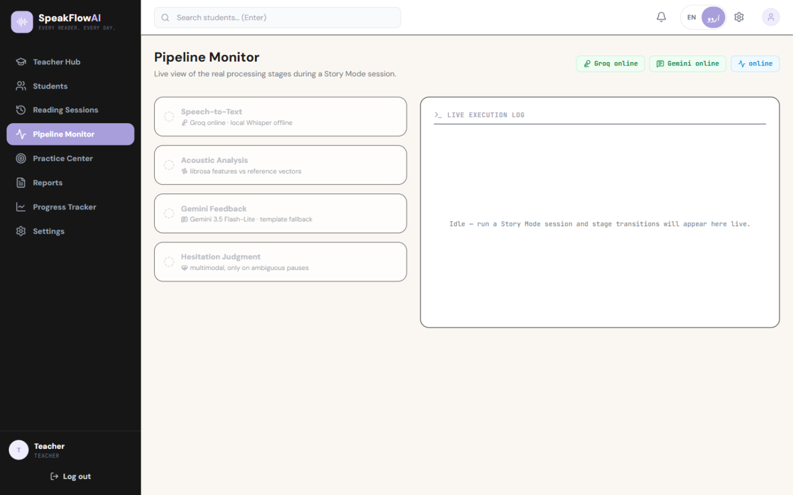
  <br><i><sub><b>Pipeline Monitor</b>: watch the five agents and every processing stage live, with Groq / Gemini reachability at a glance.</sub></i>
</td>
<td width="50%" align="center">
  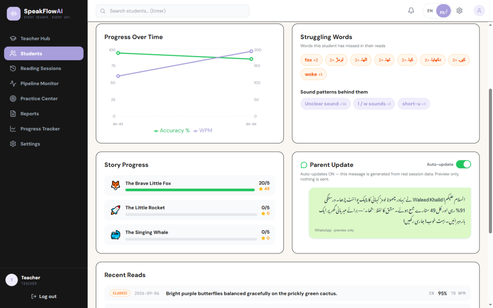
  <br><i><sub><b>Parent updates</b>: an auto-generated WhatsApp-style message in Urdu or English, built from real session data and previewed per student.</sub></i>
</td>
</tr>
<tr>
<td width="50%" align="center">
  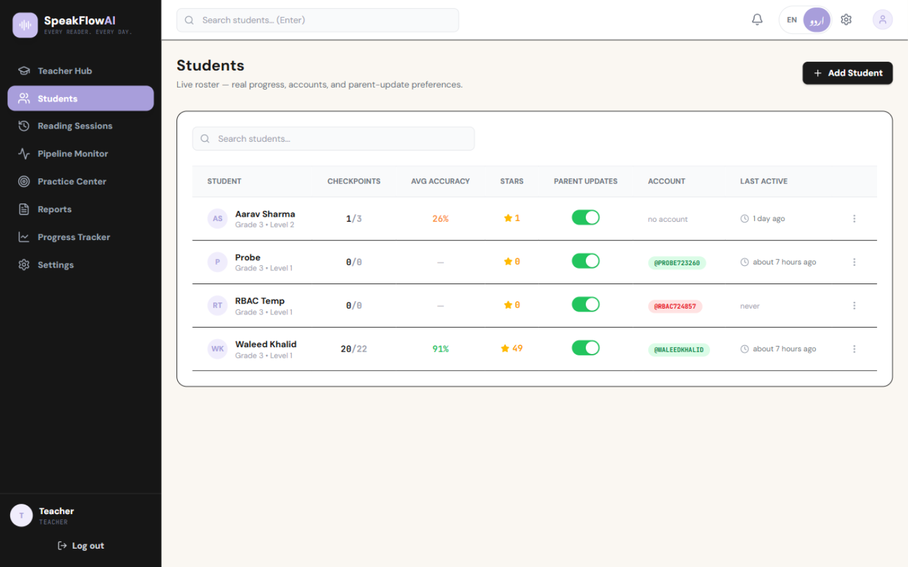
  <br><i><sub><b>Live roster</b>: per-student checkpoints, accuracy, stars, account status and parent-update preferences at a glance.</sub></i>
</td>
<td width="50%" align="center">
  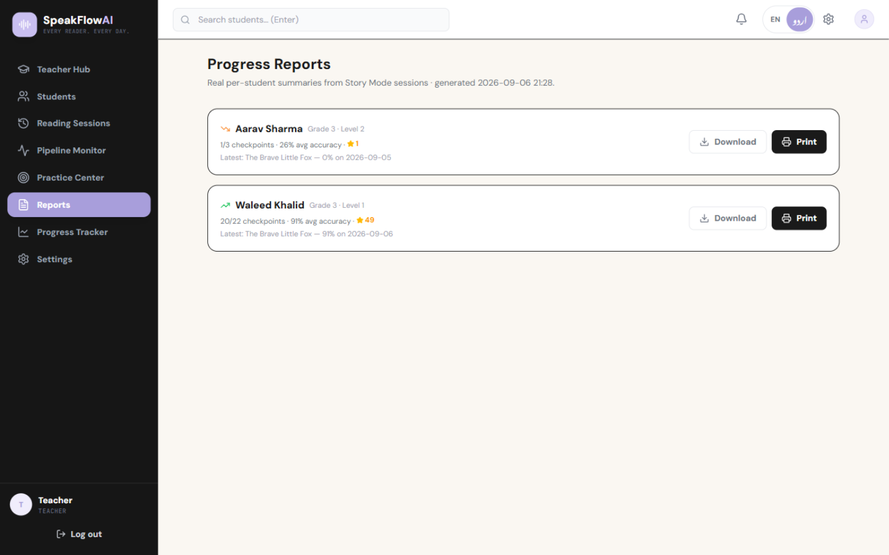
  <br><i><sub><b>Progress reports</b>: real per-student summaries with download and print, generated from actual session data.</sub></i>
</td>
</tr>
</table>

---

## ✨ Feature Pillars

### 🎙️ Two complete reading engines, one honest scorer

- **Reading Session Dashboard (classic engine):** a fresh AI-generated warm-up sentence every
  session (Easy / Medium / Hard), live waveform capture, Groq Whisper with automatic offline
  fallback to local Whisper, real telemetry (WPM, long pauses, duration), and five Gemini
  Flash-Lite agents: Phonetic Analyst, Difficulty Assessor, Engagement Tracker, Practice
  Generator, Progress Synthesizer.
- **Story Mode (two-phase engine):** an endless, dual-track adventure. Levels are generated
  on demand by Gemini (themed worlds like Enchanted Forest, Ocean Cove and Space Station,
  with an and a boss tongue-twister every fifth level), cached so every student
  plays the same level N, and tracked per language with a real star economy (3★ ≥95, 2★ ≥80,
  1★ ≥70). Level N+1 unlocks when N is passed, so the map never caps.
- **Letter-by-letter inspector:** tap any word to see a Target vs You-Said character diff
  (adapted from our story-mode reference design), hear the word, and get a coach tip.
- **The same measurement core:** word alignment + morphology detection (`missing -ed`,
  `added -ing`), extra-word penalties, Whisper word confidence, and per-word acoustic features.
  What is green in one engine means exactly the same in the other.

### 🤖 Five agents, one diagnosis

The classic engine is not one model guessing a score. Every recording is dispatched to
**five Gemini Flash-Lite agents that run in parallel**, each with its own expert role, and their
combined JSON verdict is what lands on the dashboards:

| Agent | What it figures out | Feeds |
|---|---|---|
| 🗣️ **Phonetic Analyst** | Exactly which sound patterns and words caused trouble (`dr blend`, `past-tense ed`), with the transcript words that prove it | Word highlighting, Sounds to Practice, practice targeting |
| 📚 **Difficulty Assessor** | Whether the sentence was too easy or too hard for this reader's grade, and the primary issue | Primary Issue card, difficulty adaptation |
| 💓 **Engagement Tracker** | The child's state while reading (calm, hesitant, frustrated) from pitch variance and pauses | Emotional State, coaching tone |
| 🎯 **Practice Generator** | Five custom sentences that adapt: strong reads earn hard mastery tongue-twisters, shaky reads get short wins on flagged words | Targeted Practice |
| 📈 **Progress Synthesizer** | The multi-session trend line (improving, stable, needs attention) | Progress notes for the teacher |

Phase 1 runs agents 1-3 in parallel, then 4 and 5 fan out with the combined diagnosis; the whole
verdict lands in seconds on the free tier. You can watch every agent light up live in the
**Pipeline Monitor**, complete with per-stage latencies, and swap the model (Flash-Lite / Gemma)
or the STT engine from Settings without touching code.

### 🗣️ Truly bilingual: English & اردو

- One **EN | اردو** switch drives everything: sentence generation, STT language, phoneme
  confusion tables (ق/ک، د/ڈ، ص/س…), agent output language, RTL Nastaliq rendering and the
  device's Urdu TTS voice.
- Urdu feedback, practice sentences and encouragement notes are generated in natural Urdu,
  verified live end to end.
- Word tips explain Urdu-letter mix-ups in Urdu ("د vs ڈ").

### 👧 Built for children

- **Tap any word** → letter tiles, syllable breakdown, what was actually heard, and a Gemini
  coach tip. Every word also has a **Hear this word** button, and every sentence a
  **Hear it first** button (browser TTS, zero API cost).
- A friendly star mascot celebrates every checkpoint; rewards, stars and badges make practice
  feel like play.
- First-session friction is zero: students self-register, the teacher approves, done.

### 📊 Teacher intelligence

- Class dashboard: active students, sessions today, class accuracy trend and a **per-sound
  struggling heatmap** (English and Urdu sounds ranked).
- Live roster with per-student accuracy, checkpoints, stars and last activity; drill into any
  student for trends, struggling words and an auto-generated Urdu **parent update**.
- Reports export, checkpoint-level class overview, account approvals, and **live API-key
  management** (keys are editable at runtime, no restart).
- **WhatsApp-style parent updates**: an auto-generated message per student, written in Urdu or
  English from real session data ("91% this week, 49 stars"), previewed on the student page
  with an auto-update toggle. Nothing is sent without the teacher.

### 🌐 Offline-first & classroom-ready

- Internet gone? STT falls back to local Whisper, feedback falls back to a template bank and
  sessions queue for cloud sync on reconnect.
- One `--local-host` flag puts the whole classroom on the teacher's laptop: tablets open the
  dashboard, recordings go to the LAN backend, nothing leaves the room.

---

## 🏗️ Architecture

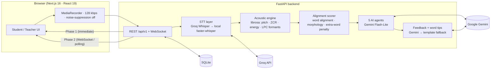

**Per-recording pipeline:** mic capture → Groq/local transcription with word timestamps →
librosa feature extraction over each word's exact timespan → `difflib` word alignment against
the printed sentence with morphology + inserted-word detection → composite 0–100 word scores →
Gemini Flash-Lite agents & coaching → SQLite persistence → teacher analytics.

---

## 🧰 Tech Stack

| Layer | Technology | Why |
|---|---|---|
| Frontend | Next.js 16 (App Router), React 19, TypeScript, Tailwind CSS v4 | Fast, typed, zero component-lib dependency, custom kid-friendly design system |
| Charts | Recharts | Progress trends for students and teachers |
| Backend | FastAPI (Python), WebSockets | Two-phase analysis with async push |
| STT | Groq Whisper large-v3 → faster-whisper (INT8) | ~1s cloud accuracy, graceful offline fallback |
| Acoustics | librosa (pyin, LPC, ZCR, RMS) | Language-independent evidence |
| AI reasoning | Google Gemini Flash-Lite (5-agent diagnosis, feedback, tips) | ~1s per agent on the free tier |
| TTS | Browser speechSynthesis | Free, offline, EN + Urdu voices |
| Animation | Framer Motion | Game-feel transitions, star bursts, level-map motion |
| Storage | SQLite (raw SQL, no ORM) | Zero-setup, local-first, easy backup |

---

## ⚡ Quick Start

**Prerequisites:** Python 3.11+, Node.js 20+, and [ffmpeg](https://ffmpeg.org) on your `PATH`
(audio decoding).

```bash
# 1, Backend
cd backend
pip install -r requirements.txt
cp .env.example .env          # add GROQ_API_KEY and GOOGLE_API_KEYS
python -m uvicorn main:app --port 8000

# 2, Frontend (new terminal)
cd frontend
npm install
npm run build && npm start    # http://localhost:3000

# 3, Sign in
#    Teacher:  teacher / speakflow123
#    Students: sign up → teacher approves (Settings → Student Accounts)
```

> **Classroom / LAN mode:** start the backend with `python main.py --local-host` and open
> `http://<teacher-laptop-ip>:3000` from any tablet on the same network.

> **Urdu:** flip the **EN | اردو** switch in the top bar, sentences, STT, feedback, practice
> and TTS all switch with you.

---

## 📁 Project Structure

```
├── backend/
│   ├── main.py                  # FastAPI app, CORS, error envelope, LAN flag
│   ├── routers/                 # auth · v1 (two-phase) · teacher · classic pipeline
│   ├── services/                # stt · acoustic · reasoning · dictionary · sync
│   ├── agents/                  # 5-agent Gemini diagnosis orchestrator
│   ├── data/                    # stories · confusion tables · reference vectors
│   ├── scripts/calibrate.py     # confusion-matrix + reference-vector tool
│   └── test_v2_pipeline.py      # isolated end-to-end suites
└── frontend/
    ├── app/read/                # Story Mode (map + checkpoint player)
    ├── app/(app)/               # dashboard · teacher · progress · practice · settings
    ├── components/              # dashboard cards, auth gates, word popovers, mascot
    ├── context/                 # Gen-1 + Story Mode session state
    └── lib/                     # typed API client · TTS · preferences
```
<details><summary>Legacy & reference material</summary>

`docx/` (early test scripts), `HACKATHON_QA_DEFENSE.*`, `KAGGLE_WRITEUP.md`, flowchart assets and
`start_speakflow.bat` are kept for provenance. `Context/` holds the original product spec and
`assets/` the design guide, logo and screenshots.

</details>

---

## 🗺️ Roadmap

- [x] Two-phase reading engine (REST + WebSocket) with Gemini coaching
- [x] Classic multi-agent dashboard with dynamic difficulty sentences
- [x] Morphology-aware scoring (`missing -ed` / `added -ing`) and extra-word penalties
- [x] Literal-dictation STT conditioning (Groq + local fallback)
- [x] Full English + Urdu support (STT, feedback, practice, RTL, TTS)
- [x] Practice Center with improving / new / conquered trends
- [x] Teacher analytics, reports and approvals
- [x] Browser TTS sentence & word playback
- [x] Expanded Story Mode: endless dual-track levels (English / اردو) generated by Gemini,
      themed worlds, boss levels, star economy, letter-by-letter inspector
- [ ] Urdu reference-vector calibration from real child recordings
- [ ] Cloud sync endpoint for offline classrooms

---

## 🤝 Contributing

1. Fork → create a branch: `feature/my-feature` or `fix/my-fix`
2. Keep commits [Conventional](https://www.conventionalcommits.org): `feat(story-mode): …`
3. Run the backend suites before pushing: `python test_v2_pipeline.py && python _auth_test.py`
4. Open a PR against `main`, screenshots for UI changes are appreciated.

## 📄 License

Released under the [MIT License](LICENSE).

---

<div align="center">
<sub>Built with ❤️ for young readers by <b>TeamXOF</b> · Waleed Khalid · Muhammad Ali · Muhammad Nafees</sub>
</div>
